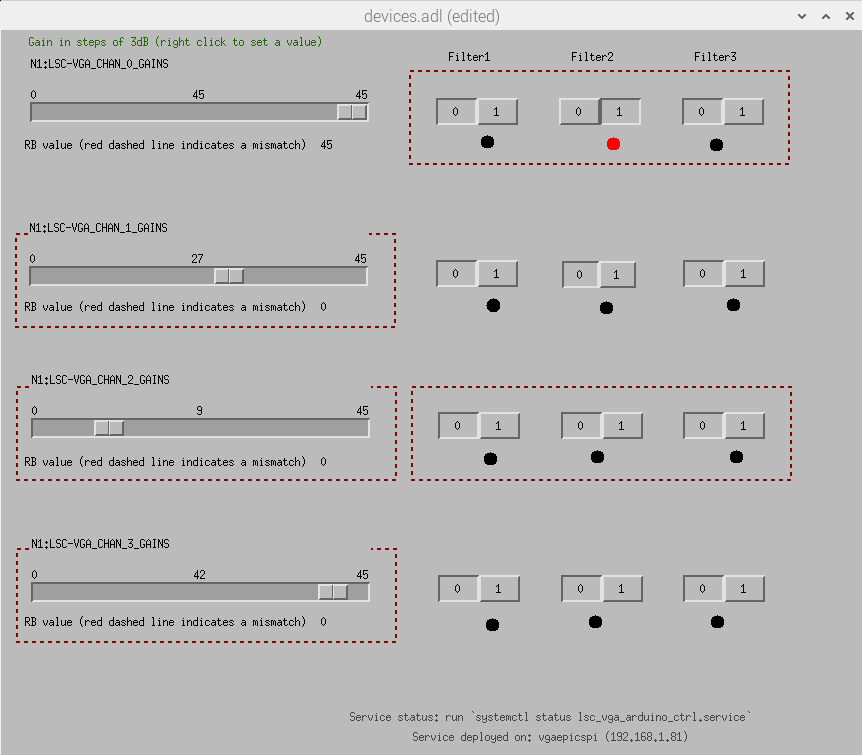

# [VGA] MEDM Screen of VGA Control

    []: # Version: 0.2
    []: # Date: 2022-06-23
    []: # Updated: 2022-06-24

## MEDM Screen

- There are four channels with each channel having gain and filter settings for users to control.
- The gains increment and decrement by 3dB, ranging from 0 to 45dB (max).
  - Click on the gain slide bar to increment or decrement the gain by 3dB.
  - Or right click on the gain slide bar to set the gain to a specific value. Note the value will be rounded up to the nearest multiple of 3dB.
- The filters can be turned on or off by clicking the choice button.
  - The red button indicates the filter is on, and the black button indicates the filter is off.
- The red dashed lines around each gain and filter settings indicate the mismatch between the set value we send to the VGA (digital input) and the readback value we receive from the VGA (digital readback).
- At the bottom of the screen, there is information on how to get the service status and where this service is running.

## TODO

- [ ] Add a test setup for the VGA:
  - [ ] Macro file for `SYSTEM`, `SUBSYSTEM` to replace `N1` and `LSC` in the EPICS channel names when we deploy the service to the CDS network. This should be separated from the test channels to avoid confusion.
  - [ ] How to properly and efficiently manage the status of each service status shown on the MEDM screen?
    - Right now the service is just a string which can only be updated manually.
    - A centralized file (like `json` or `yaml` configuration file) can be used to manage the status of each service? This can be read once we load the service.
- [ ] Try to convert it to `caQtDM` screen.
